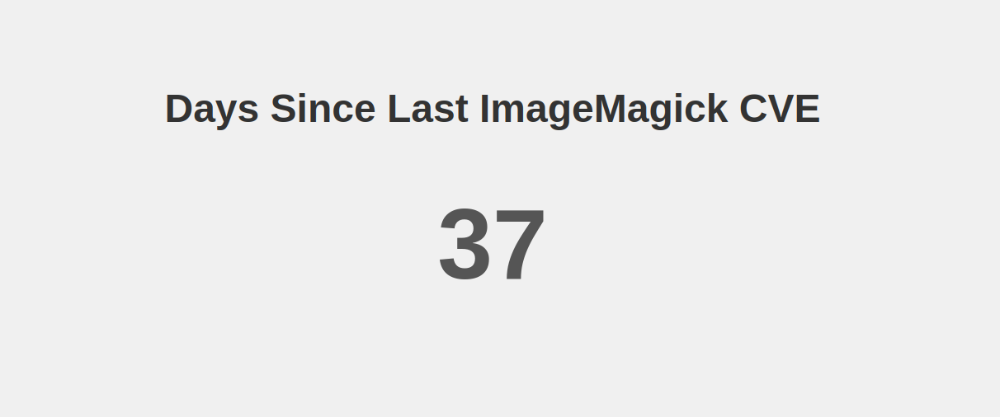

# ImageMagick CVE Tracker

ImageMagick CVE Tracker is a small web app that tracks the days since the last reported ImageMagick CVE. It uses the National Vulnerability Database (NVD) API to fetch the latest CVEs related to ImageMagick.

## Usage

It's just an index.html
